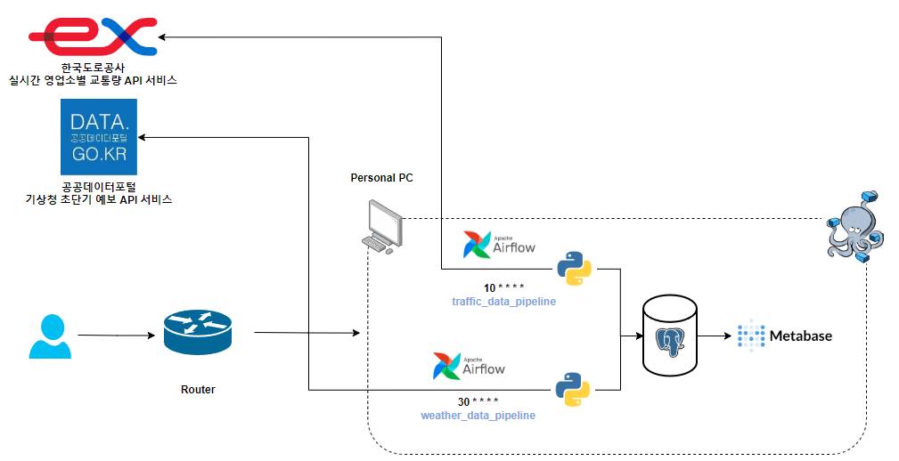
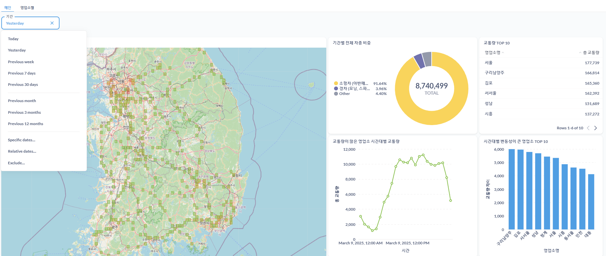
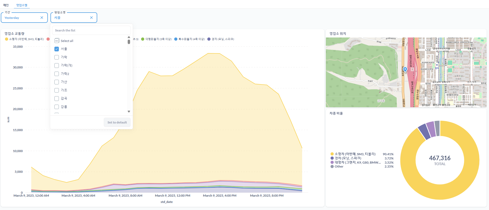

# 🚗 너의 교통은

---

## 기능 소개

"너의 교통은" 프로젝트는 영업소별 교통량 데이터를 수집하고 이를 Metabase 대시보드를 통해 시각화하는 시스템입니다.

---

## 사용 기술

프로젝트 사용 기준

* Docker: 컨테이너 기반 배포 및 실행 환경
* Docker Compose: 여러 컨테이너 오케스트레이션 관리
* Apache Airflow: ETL(Extract, Transform, Load) 파이프라인 관리
* Python: 데이터 수집 및 처리
* Metabase: 데이터 시각화 및 대시보드 제공
* PostgreSQL: 데이터 저장 및 관리

---

## 프로젝트 아키텍처

본 프로젝트는 다음과 같은 주요 컴포넌트로 구성 됩니다.

* 데이터 수집
  * Python 스크립트를 활용하여 실시간 영업소별 교통량 API 서비스와 기상청 초단기 예보 API를 통해 수집
  * 수집된 데이터는 전처리 후 PostgreSQL에 저장

* 데이터 처리 및 ETL
  * Apache Airflow를 활용하여 정기적인 데이터 적재 및 변환 수행
  * 필요 시 데이터 정제 및 변환 작업 진행

* 데이터 시각화
  * Metabase를 통해 PostgreSQL 데이터베이스의 교통량 데이터를 대시보드로 제공
  * 사용자가 손쉽게 데이터 조회 및 분석 가능

---

## 대시보드 구성

### 메인

메인 대시보드는 전체 교통량 및 혼잡도 분석을 위한 대시보드로, 지역별 혼잡도 및 주요 트렌드를 시각적으로 확인할 수 있습니다.

주요 기능

* 지역별 교통 혼잡도
  * 각 영업소의 교통 혼잡도를 색상별로 한눈에 확인할 수 있습니다.
  * 혼잡도가 높은 지역과 낮은 지역을 쉽게 비교할 수 있습니다.

* 기간별 전체 차종 비중
  * 특정 기간 동안 각 차종(소형, 중형, 대형 등)이 차지하는 비율을 확인할 수 있습니다.
  * 차종별 트렌드를 파악하여 특정 시기의 특징을 파악할 수 있습니다.

* 교통량 TOP 10 영업소
  * 가장 교통량이 많은 영업소 10곳을 리스트업하여 표시합니다.
  * 각 영업소의 교통량을 비교하고, 특정 지역의 교통 흐름을 파악하는 데 활용할 수 있습니다.

* 교통량이 많은 영업소 시간대별 교통량
  * 교통량이 가장 많은 영업소들의 시간대별 패턴을 확인할 수 있습니다.

* 시간대별 변동성이 큰 영업소 TOP 10
  * 특정 시간대에 따라 교통량 변동이 심한 영업소를 분석할 수 있습니다.

### 영업소별

영업소별 대시보드는 특정 영업소의 상세한 데이터를 조회할 수 있는 대시보드 입니다.

주요 기능

* 영업소 교통량
  * 특정 영업소의 일별, 시간별 교통량 변화를 확인할 수 있습니다.
  * 과거 데이터와 비교하여 교통량 증가 또는 감소 패턴을 분석할 수 있습니다.

* 영업소 위치
  * 지도 상에서 영업소의 위치를 확인할 수 있습니다.
  
* 차종 비율
  * 특정 영업소를 통과하는 차량의 차종별 비율을 분석할 수 있습니다.
  * 영업소별로 특정 차종이 많이 이용되는 경향을 파악하는 데 활용할 수 있습니다.

---

## 이후 프로젝트 방향

* [ ] 교통량 예측 모델링 (기후 + 교통량)
* [ ] 클라우드 환경으로 확장
* [ ] Data Lake 추가 (추가 후 flow 변경)
